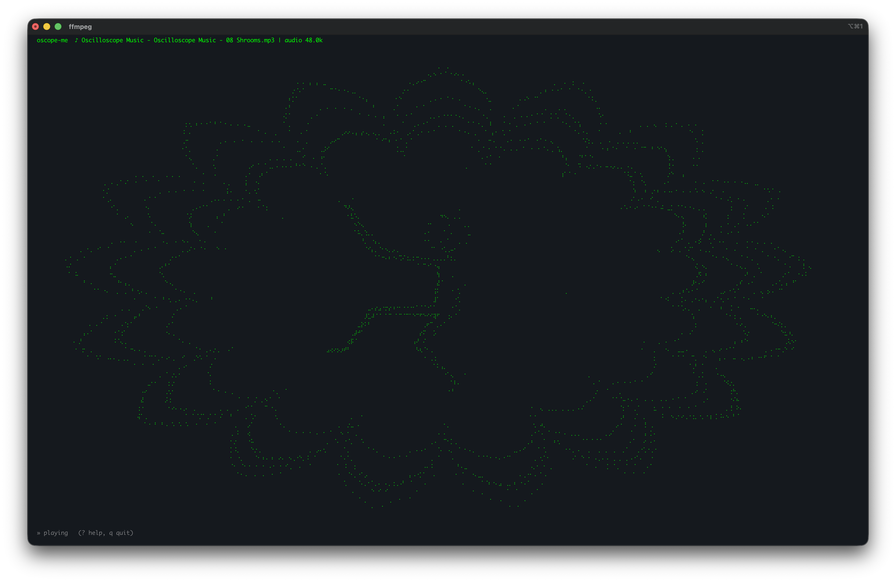

# oscope-me

Tune an FM stereo broadcast with an RTL-SDR — **or play an audio file** — and
send it to an **X/Y oscilloscope** as oscilloscope music. A terminal app: pick a
station (or a file), and it streams stereo audio to your headphone/line out while
drawing a live X/Y preview in the terminal. Tune, change volume, swap files, and
flip options live from the keyboard.



```
  oscope-me  102.5 MHz | SDR 1.200M -> MPX 240k -> audio 48.0k | de-emph 75us
                          ⢀⣴⠾⠛⠉⠉⠛⠷⣦⡀
                       ⢀⣴⠟⠁          ⠉⠻⣦⡀
                      ⡾⠋                ⠙⢷
   STEREO ●  out: External Headphones  underruns: 0   (Ctrl-C to quit)
```

## How it works

Oscilloscope music is **stereo** audio: the Left channel drives the scope's
horizontal (X) deflection and Right drives the vertical (Y). The picture is
drawn by the *difference* between the channels, so the app does a proper FM
stereo multiplex decode:

```
RTL-SDR IQ ─▶ decimate ─▶ FM discriminator ─▶ MPX baseband
   ├─ lowpass 15 kHz ─────────────────────────▶ mono (L+R)
   └─ 19 kHz pilot ─(square)─▶ 38 kHz carrier ─▶ coherent decode ─▶ (L−R)
                                                  L = mono + (L−R)
                                                  R = mono − (L−R)
```

Plus 75 µs de-emphasis (50 µs available for Europe), a DC blocker to keep the
figure centred, and an equal-gain AGC that scales L and R together so the
*shape* of the image is preserved. Measured stereo separation is ~30 dB, so the
figures come through clean.

> Note: broadcast FM band-limits each channel to 15 kHz, so the finest detail in
> a piece of oscilloscope music is softened over the air — that's a property of
> the medium, not this app.

## Install

You need the `rtl-sdr` command-line tools (for the `rtl_sdr` / `rtl_test`
binaries) and Python 3.10+.

**macOS (Apple Silicon or Intel):**
```bash
brew install librtlsdr            # provides rtl_sdr, rtl_test, ...
git clone <this repo> && cd oscope-me
python3 -m venv .venv && source .venv/bin/activate
pip install -e .
```

**Linux (Debian/Ubuntu):**
```bash
sudo apt install rtl-sdr librtlsdr-dev libportaudio2 make python3.14-venv pulseaudio
git clone <this repo> && cd oscope-me
make venv
make run
```

Use `alsamixer` to control volume.

On Linux you may need a udev rule so the SDR is usable without root, and to
blacklist the DVB-T kernel driver:
```bash
echo 'blacklist dvb_usb_rtl28xxu' | sudo tee /etc/modprobe.d/blacklist-rtl.conf
```

## Usage

```bash
oscope-me                 # waits for SDR, then prompts for a frequency
oscope-me -f 102.5        # tune 102.5 MHz directly
oscope-me -i song.flac    # play a file (flac/mp3/wav/ogg/m4a/...) instead
oscope-me -i song.wav --no-loop   # play once instead of looping
oscope-me -f 102.5 --no-scope     # audio only, no terminal preview
oscope-me --list-audio            # list output devices
oscope-me -f 102.5 --audio-device "External Headphones"
oscope-me -f 102.5 --audio-rate 192000   # high-rate output for the DAC
```

In **SDR mode** it waits for an RTL-SDR to be plugged in, asks for a frequency
(or uses `--default-freq`), then streams. In **file mode** (`-i FILE`) it decodes
the file with ffmpeg and plays it straight to X/Y (oscilloscope-music files are
already stereo, so no FM decode is needed); it loops by default. Either way, plug
headphones / a line-out cable in and the audio follows your system default
output. Ctrl-C (or `q`) to quit.

### Live controls

The app is interactive — press keys while it's running:

| Key | Action |
|-----|--------|
| `+` / `-` | volume up / down |
| `?` or `h` | toggle the help overlay |
| `q` | quit |
| **SDR mode** | |
| `↑` / `↓` (or `.` / `,`) | tune ∓0.1 MHz |
| `→` / `←` (or `>` / `<`) | tune ∓1.0 MHz |
| `f` | type in a frequency |
| `g` | set tuner gain (dB or `auto`) |
| `p` | set ppm correction |
| `m` | mono / stereo toggle |
| `d` | cycle de-emphasis 75 → 50 → off |
| `space` | mute / unmute |
| `o` | switch to playing a file |
| **File mode** | |
| `space` | pause / resume |
| `r` | restart from the beginning |
| `l` | loop on / off |
| `o` | open another file |
| `f` | switch to SDR tuning |

Changes that the radio/decoder bakes in (frequency, gain, mono, file, loop) take
effect with a quick restart; volume and mute are instant.

### Wiring to the oscilloscope

1. Set the scope to **X/Y mode**.
2. Laptop **Left** channel → scope **X** (horizontal) input.
3. Laptop **Right** channel → scope **Y** (vertical) input.
4. Use a shielded stereo cable; for a high `--audio-rate` keep it short and
   well shielded to avoid degradation.

Start with the scope's X and Y gains roughly equal, then trim to taste.

### Key options

| Flag | Meaning |
|------|---------|
| `-i, --input FILE` | Play an audio file instead of the SDR (needs ffmpeg). |
| `--loop` / `--no-loop` | Loop the file forever (default) or play once. |
| `-f, --freq MHz` | FM frequency. Omit to be prompted. |
| `-g, --gain dB` | Tuner gain, or `auto` (default). |
| `--audio-rate Hz` | Output sample rate: 48000 (default), 96000, 192000. |
| `--deemphasis` | `75` (Americas, default), `50` (Europe), or `off`. |
| `--mono` | Force mono — collapses the X/Y image to a diagonal line. |
| `-p, --ppm` | Tuner frequency correction in ppm. |
| `--no-scope` | Skip the terminal preview (audio only). |
| `--volume` | Output level multiplier. |

## Troubleshooting

- **"rtl_sdr / rtl_test not found"** — install the `rtl-sdr` tools (see above).
- **Stuck on "Waiting for an RTL-SDR…"** — check `rtl_test` sees the device; on
  Linux make sure the DVB-T driver is blacklisted and udev permissions are set.
- **`mono ○` instead of `STEREO ●`** — the station has no 19 kHz pilot or the
  signal is weak. Try a stronger station, a better antenna, or set `-g` manually.
- **Crackling / `underruns` climbing** — increase `--audio-buffer` (e.g. `2.0`).

## Tests

```bash
python tests/test_dsp.py   # synthesises an FM stereo signal and checks separation
```

## Requirements

- Python 3.10+ with `numpy`, `scipy`, `sounddevice` (installed via `pip install -e .`)
- For **SDR mode**: the `rtl-sdr` CLI tools and an RTL2832U-based SDR (e.g. NooElec
  NESDR, RTL-SDR Blog v3/v4)
- For **file mode**: `ffmpeg` (`brew install ffmpeg` / `apt install ffmpeg`) — only
  needed if you use `-i`
